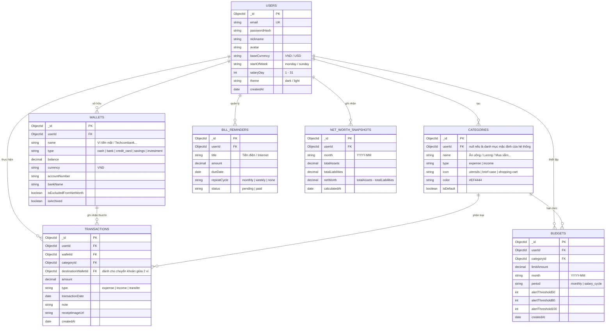

# FinanceFlow - Thiết kế Database Schema (MongoDB)

Tài liệu thiết kế cấu trúc Cơ sở dữ liệu cho ứng dụng FinanceFlow, bám sát nghiệp vụ trong `Phân tích nghiệp vụ.docx` và `DS CHỨC NĂNG.xlsx`.

---

## 1. Sơ đồ Quan hệ Thực thể (ERD - Mermaid)



---

## 2. Chi tiết Cấu trúc các Collections (MongoDB Schema)

### 2.1 Collection: `users`
Lưu trữ tài khoản người dùng, cấu hình tiền tệ và chu kỳ tài chính (ngày nhận lương).

```json
{
  "_id": { "$oid": "660000000000000000000001" },
  "email": "user@financeflow.vn",
  "passwordHash": "$2b$10$e8wF5q...",
  "nickname": "Hoàng Nam",
  "avatar": "https://cdn.financeflow.vn/avatars/u1.png",
  "baseCurrency": "VND",
  "startOfWeek": "monday",
  "salaryDay": 5,
  "theme": "dark",
  "createdAt": { "$date": "2026-10-01T08:00:00.000Z" },
  "updatedAt": { "$date": "2026-10-01T08:00:00.000Z" }
}
```
**Indexes**:
- `email`: Unique index `{ email: 1 }` (unique: true)

---

### 2.2 Collection: `wallets`
Quản lý đa ví / tài khoản ngân hàng / thẻ tín dụng / tiết kiệm.

```json
{
  "_id": { "$oid": "660000000000000000000010" },
  "userId": { "$oid": "660000000000000000000001" },
  "name": "Tài khoản MB Bank",
  "type": "bank",
  "balance": 15000000.00,
  "currency": "VND",
  "accountNumber": "0987654321",
  "bankName": "MB Bank",
  "isExcludedFromNetWorth": false,
  "isArchived": false,
  "createdAt": { "$date": "2026-10-01T08:00:00.000Z" }
}
```
**Indexes**:
- `{ userId: 1, isArchived: 1 }`

---

### 2.3 Collection: `categories`
Danh mục thu / chi (hệ thống cung cấp sẵn + người dùng tự tạo thêm).

```json
{
  "_id": { "$oid": "660000000000000000000020" },
  "userId": null,
  "name": "Ăn uống",
  "type": "expense",
  "icon": "utensils",
  "color": "#F97316",
  "isDefault": true
}
```
**Indexes**:
- `{ userId: 1, type: 1 }`

---

### 2.4 Collection: `transactions`
Lưu vết từng giao dịch thu, chi hoặc luân chuyển tiền.

```json
{
  "_id": { "$oid": "660000000000000000000030" },
  "userId": { "$oid": "660000000000000000000001" },
  "walletId": { "$oid": "660000000000000000000010" },
  "categoryId": { "$oid": "660000000000000000000020" },
  "destinationWalletId": null,
  "amount": 85000.00,
  "type": "expense",
  "transactionDate": { "$date": "2026-10-01T12:30:00.000Z" },
  "note": "Ăn trưa cơm văn phòng",
  "receiptImageUrl": null,
  "createdAt": { "$date": "2026-10-01T12:30:00.000Z" }
}
```
**Indexes quan trọng để truy vấn nhanh**:
- `{ userId: 1, transactionDate: -1 }` (Hiển thị danh sách giao dịch gần nhất)
- `{ userId: 1, categoryId: 1, transactionDate: -1 }` (Tính toán ngân sách & Biểu đồ)
- `{ userId: 1, amount: -1 }` (Bảng xếp hạng Top khoản chi lớn nhất)

---

### 2.5 Collection: `budgets`
Thiết lập ngân sách theo danh mục & theo dõi mốc cảnh báo (50%, 80%, 100%).

```json
{
  "_id": { "$oid": "660000000000000000000040" },
  "userId": { "$oid": "660000000000000000000001" },
  "categoryId": { "$oid": "660000000000000000000020" },
  "limitAmount": 3000000.00,
  "month": "2026-10",
  "period": "salary_cycle",
  "alertThreshold50": true,
  "alertThreshold80": true,
  "alertThreshold100": true,
  "createdAt": { "$date": "2026-10-01T08:00:00.000Z" }
}
```
**Indexes**:
- `{ userId: 1, month: 1, categoryId: 1 }` (Unique compound index)

---

### 2.6 Collection: `net_worth_snapshots`
Lưu trữ ảnh chụp báo cáo tài sản ròng theo từng tháng (Tài sản vs Nợ).

```json
{
  "_id": { "$oid": "660000000000000000000050" },
  "userId": { "$oid": "660000000000000000000001" },
  "month": "2026-10",
  "totalAssets": 150000000.00,
  "totalLiabilities": 25000000.00,
  "netWorth": 125000000.00,
  "calculatedAt": { "$date": "2026-10-01T23:59:59.000Z" }
}
```
